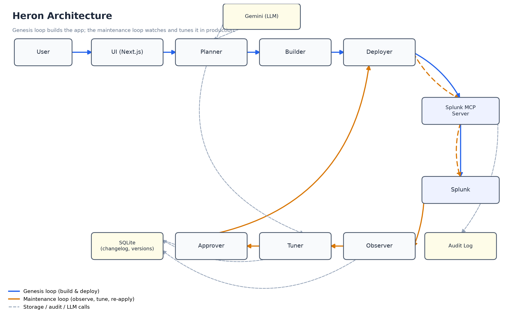

# Heron

The Splunk app that builds and maintains itself.



## What it does

Heron turns a plain-English monitoring request into a working Splunk app: it plans
the app, generates its configuration files and dashboards, deploys it to Splunk,
and validates that data is actually flowing. Then it keeps watching that app in
production — and when the data tells it something should change, it proposes the
change, explains why in plain language, and applies it automatically if it's
low-risk.

## Demo video

[Demo video link goes here]

## Why this is different

Most agentic Splunk tools are open-loop: they read your data, generate a
recommendation, and stop — their output is advice that a human still has to act
on. Heron is closed-loop. It produces a real artifact (a deployed Splunk app),
watches what happens to that artifact in production, and adjusts it on its own.
The genesis loop — building an app from a prompt — is the easy part to demo;
the maintenance loop, where Heron notices its own alert is too noisy and quietly
fixes it, with a written rationale and a full audit trail, is the part that makes
Heron labor instead of advice.

## How it works

**The use case:** "I need to monitor pod restart spikes in our payments
namespace. Alert me when there are more than 5 restarts in 10 minutes for any pod
in that namespace."

**Genesis loop** — `User → UI → Planner → Builder → Deployer → MCP Server → Splunk`

1. The **Planner** (Gemini) turns the prompt into a structured `BuildPlan`: a data
   source (`kubernetes:events`), field extractions for `pod_name`, `namespace`,
   `event_type`, `restart_count`, and `timestamp`, a set of saved searches, a
   dashboard, and an alert with an initial threshold of 5 restarts in 10 minutes.
2. The **Builder** renders that plan into real Splunk app files —
   `inputs.conf`, `props.conf`, `transforms.conf`, `savedsearches.conf`, dashboard
   XML, and `metadata/default.meta`.
3. The **Deployer** pushes the app to Splunk through the Splunk MCP Server (every
   write goes through MCP, so every change is audited) and runs post-deploy
   validation: app installed, data flowing, searches returning results.

All of this streams live to the UI's Build view over Server-Sent Events.

**Maintenance loop** — `Splunk → Observer → Tuner → Approver → Deployer → MCP Server → Splunk`

1. The **Observer** periodically queries Splunk for signals about the deployed
   app — in v1, how often the pod-restart alert is firing.
2. The **Tuner** (Gemini) looks at that signal and proposes a concrete change —
   e.g. "this alert fired 30 times in the last hour on noisy restart bursts;
   raise the threshold from 5 to 12" — with a plain-language rationale.
3. The **Approver** routes the proposal: low-risk threshold nudges are applied
   automatically, higher-risk changes are queued for human approval in the
   Approvals view. Every applied change writes a versioned changelog entry and
   can be rolled back.

## Tech stack

- **Backend**: Python 3.11+, FastAPI, async throughout
- **LLM provider**: Google Gemini (`gemini-2.5-flash`) via the official
  `google-genai` SDK — used by the Planner and Tuner
- **Splunk integration**: Splunk Python SDK for reads, Splunk MCP Server for all
  writes
- **Frontend**: Next.js (App Router), TypeScript, Tailwind CSS
- **Database**: SQLite (`aiosqlite`) for changelog, versions, and approval queue
- **Streaming**: Server-Sent Events for the live build view
- **Templates**: Jinja2 for Splunk conf-file generation

## Scope notes

**Implemented in v1:**

- Full genesis loop for the Kubernetes pod-monitoring use case
- One maintenance behavior, fully working end to end: alert auto-tuning
  (Observer reports firing frequency → Tuner proposes a new threshold → Approver
  auto-applies low-risk changes)
- All Splunk writes routed through the Splunk MCP Server, with an audit log
- Versioned changelog with rollback for every applied change
- Chat, Build (live SSE streaming), Apps, Changelog, and Approvals views

**Roadmap (architecture slots exist, not demoed):**

- SPL performance rewriting
- Schema drift detection
- Dashboard usage tracking
- Gap detection from unmatched user queries
- Multi-app and multi-tenant management

## Running it locally

### Prerequisites

- Python 3.11+
- Node.js 18+
- A running Splunk instance with the Splunk MCP Server configured
- A Gemini API key (free tier via Google AI Studio)

### Backend

```bash
cd backend
python -m venv .venv
.venv\Scripts\activate      # on macOS/Linux: source .venv/bin/activate
pip install -e .
cp .env.example .env        # fill in GEMINI_API_KEY, SPLUNK_*, SPLUNK_MCP_*
uvicorn heron.main:app --reload
```

### Frontend

```bash
cd frontend
npm install
npm run dev
```

Open http://localhost:3000 — the Chat view is the entry point.

### Synthetic K8s data

The pod-monitoring app expects Kubernetes event JSON at
`/var/log/heron/k8s_events.json`. Generate it with:

```bash
cd backend
python scripts/generate_k8s_data.py --mode normal   # ~1-2 restarts/hour
python scripts/generate_k8s_data.py --mode noisy    # 10+ restarts/min, triggers the alert
```

### Stage a full demo

To reproduce the "two weeks later" demo state (deployed app + an autonomous
alert-tuning changelog entry, backdated for the narrative) in one shot:

```bash
cd backend
python -m scripts.stage_demo
```

## License

MIT — see [LICENSE](LICENSE).
